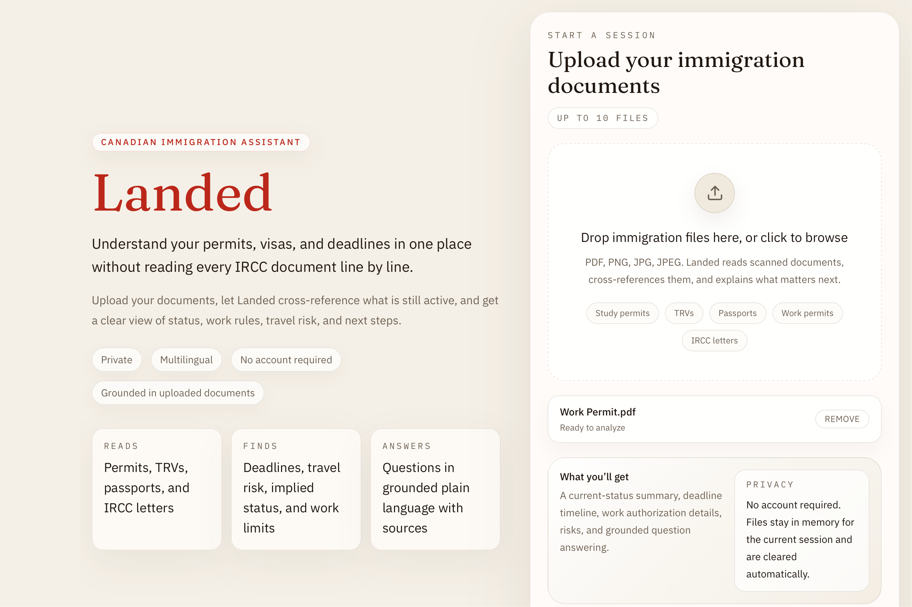

# Landed

**Your immigration documents, finally explained.**

Landed is a local-first immigration document assistant for Canadian temporary residents. Upload your permits, visas, passports, and IRCC letters — Landed reads them together, surfaces your deadlines, and tells you exactly what to do next. In any language.

**GitHub:** `https://github.com/absolute-xero7/landed`

## Demo



[▶ Watch the demo](https://youtu.be/-t-ufUA2AhQ)

---

## Inspiration

In August 2025, my Temporary Resident Visa expired while I was visiting India. I missed the start of my Winter 2026 semester at the University of Toronto. For three weeks I wrote letters to IRCC officers, university officials, and my MP — trying to resolve a situation that started with one line in one document I had not understood.

The frustrating part was not the bureaucracy itself. It was that the information I needed existed. It was printed on my documents. I just did not know how to read them together, what the deadlines meant, or what would happen if I missed them. A licensed immigration consultant would have caught it in minutes. Most people cannot afford one.

Landed was built so that never happens to someone else. It reads your documents the way a consultant would — across all of them at once — and tells you exactly what your situation is, what you need to do, and what happens if you don't.

---

## What it does

Landed does not treat each document in isolation. It reasons across the full uploaded set. An expired work permit does not override a newer valid study permit. An expired TRV becomes a travel warning rather than a false instruction to leave Canada. A deadline buried on page 2 of a formal IRCC letter gets surfaced automatically.

The output is practical:

- Current immigration status in plain English
- Every deadline from every document in one unified timeline
- Processing time windows — not just when your permit expires, but when to apply today to be safe
- Consequences for missing each deadline
- Implied status guidance
- Work authorization details extracted from permit conditions
- Missing document warnings
- Grounded Q&A that cites the specific document behind every answer
- All of the above in any of 8 languages

---

## Architecture

```
+------------------------ Frontend (Next.js 14) ------------------------+
| Upload | Processing Stream | Dashboard | Documents | QA | Add Docs   |
+--------------------------------+--------------------------------------+
                                 |
                           REST + SSE
                                 |
+---------------- Backend (FastAPI + Railtracks Flow) ------------------+
| parse_document × N -> synthesize_status -> generate_action_plan       |
|                               |                                       |
|                 deterministic parser + OCR + GPT-OSS                  |
+--------------------------------+--------------------------------------+
                                 |
                        Railtracks Visualizer (:3030)
```

The upload pipeline runs as a Railtracks `rt.Flow`. Each step is a `@rt.function_node`:

1. `parse_document × N` — runs once per uploaded file in sequence
2. `synthesize_status` — cross-document reasoning across all parsed results
3. `generate_action_plan` — enriches required actions with IRCC knowledge base data

---

## Tech Stack

| Layer | Technology |
|---|---|
| Frontend | Next.js 14, TypeScript, Tailwind CSS, Framer Motion, Zustand, react-dropzone |
| Backend | FastAPI, Pydantic, sse-starlette |
| Flow Orchestration | Railtracks |
| LLM | GPT-OSS 120B via OpenAI-compatible HuggingFace endpoint |
| OCR / Parsing | PyMuPDF, macOS Vision OCR, deterministic IRCC parsers |
| Demo generation | reportlab |

---

## Quick Start

### 1. Backend

```bash
cd backend
python -m venv .venv
source .venv/bin/activate
pip install -r requirements.txt
cp .env.example .env
# Set OPENAI_API_KEY for GPT-OSS extraction and translation
# Leave blank to use deterministic fallback mode
.venv/bin/python demo/generate_demo_docs.py
.venv/bin/uvicorn main:app --reload --port 8000
```

### 2. Railtracks visualizer

In a separate terminal:

```bash
cd backend
.venv/bin/railtracks viz
```

Open `http://localhost:3030` to see the pipeline trace for every upload run.

### 3. Frontend

```bash
cd frontend
npm install
printf 'NEXT_PUBLIC_API_BASE_URL=http://localhost:8000\n' > .env.local
npm run dev
```

### 4. One-command startup

After backend dependencies and frontend `npm install` are complete:

```bash
chmod +x start.sh
./start.sh
```

Starts:
- App on `http://localhost:3000`
- API on `http://localhost:8000`
- Railtracks visualizer on `http://localhost:3030`

---

## Demo

### Recommended demo flow

1. Run `backend/demo/generate_demo_docs.py` to generate sample documents
2. Upload the demo set — a study permit, TRV letter, IRCC correspondence, and work permit
3. Watch the processing stream extract document types and surface the deadline buried in the IRCC letter
4. Confirm the dashboard shows the active study permit as the current status
5. Confirm the expired TRV appears as a travel warning, not a false leave-Canada instruction
6. Ask grounded questions:
   - `Can I work while studying?`
   - `Can I travel and come back to Canada?`
   - `What documents are missing?`
7. Open `localhost:3030` to show the Railtracks pipeline trace

### Demo documents

Located in `backend/demo/`:
- `Passport.pdf`
- `Study Permit.pdf`
- `TRV.pdf`
- `Work Permit.pdf`

Regenerate with:

```bash
cd backend
.venv/bin/python demo/generate_demo_docs.py
```

---

## Environment Variables

### backend/.env

| Variable | Required | Default | Description |
|---|---|---|---|
| `OPENAI_API_KEY` | Optional | — | Required for GPT-OSS extraction, translation, and Q&A. Leave blank for deterministic fallback mode. |
| `ALLOWED_ORIGINS` | Optional | `http://localhost:3000` | CORS allowed origins |
| `MAX_FILE_SIZE_MB` | Optional | `10` | Max file size per upload |
| `MAX_FILES_PER_UPLOAD` | Optional | `10` | Max files per session |

### frontend/.env.local

| Variable | Default | Description |
|---|---|---|
| `NEXT_PUBLIC_API_BASE_URL` | `http://localhost:8000` | Backend API base URL |

---

## Local Demo Mode

If `OPENAI_API_KEY` is not set, Landed runs end to end using deterministic parsing, local OCR, and fallback Q&A. This is sufficient for local development and demos. GPT-backed extraction, translation, and non-deterministic Q&A require a key.

---

## Debugging Tools

Test OCR and parsing on a single document:

```bash
cd backend
.venv/bin/python utils/test_ocr_gpt.py "demo/TRV.pdf"
```

OCR-only mode:

```bash
.venv/bin/python utils/test_ocr_gpt.py "demo/TRV.pdf" --ocr-only
```

---

## Privacy

- Uploaded files are processed in memory only
- Sessions are stored in memory and cleaned up after 2 hours
- No account system required
- No files written to disk

---

## Known Caveat

`npm run build` can fail in restricted-network environments because `frontend/app/layout.tsx` pulls Google Fonts at build time. `npm run dev` works for all local and demo use.

---

## Hackathon Tracks

- Google Best AI for Community Impact
- Bitdeer Beyond the Prototype: Best Production-Ready AI Tool
- Top 2 Teams (Overall)
- Railtracks Open-Source Showcase — RailtracksPM2